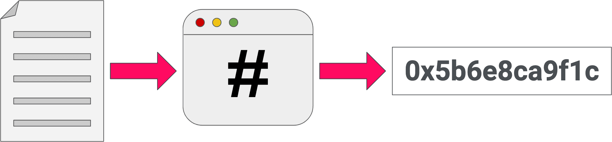
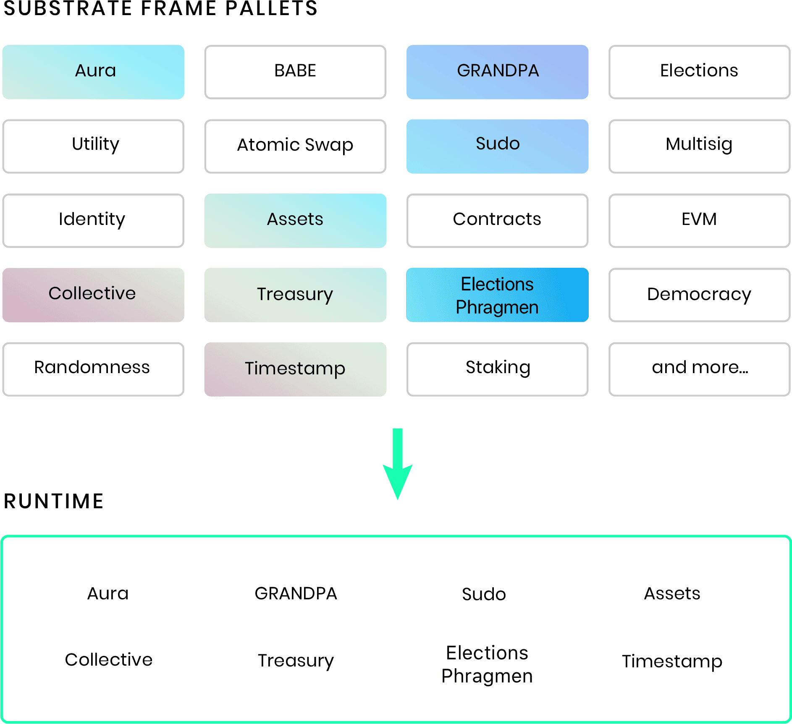
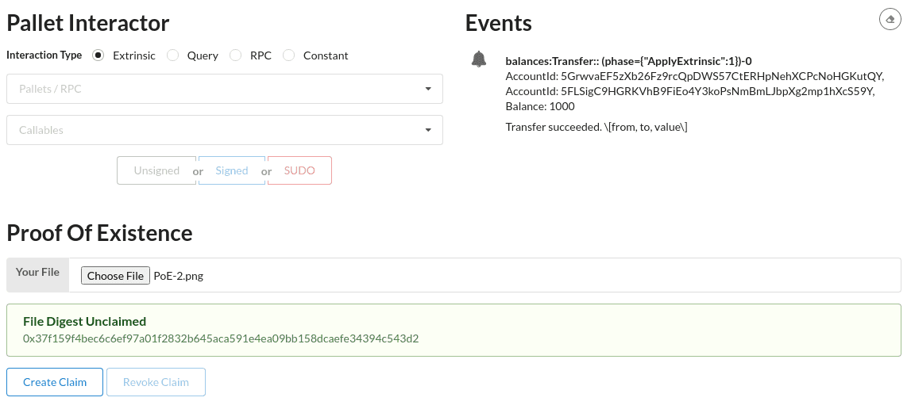
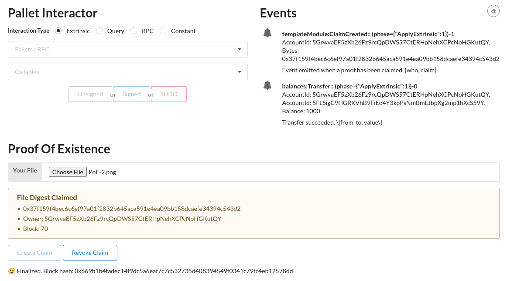

## 构建一个存证（proof of existence，简称PoE）的 dApp

本教程演示如何使用 Substrate 区块链开发框架和`FRAME`依赖库创建自定义存证（PoE）服务。

存证（PoE）服务是一种通过使用存储在区块链上的对象信息来验证数字对象的真实性和所有权的方法。因为区块链上有时间戳​​和与对象相关联的签名，所以区块链记录可用于验证（作为证据）在特定日期和时间存在特定对象。它还可以验证记录在该日期和时间的所有者是谁。

### 数字对象和哈希
区块链使用[密码学哈希](https://zh.wikipedia.org/wiki/%E5%AF%86%E7%A2%BC%E9%9B%9C%E6%B9%8A%E5%87%BD%E6%95%B8)来存储数字记录，而不是用单个文件来保存它们. 哈希使区块链能够通过使用很小且唯一的哈希值有效地存储任意大小的文件。因为对文件的任何更改都会导致不同的哈希值，用户可以通过计算哈希值并将该哈希值与存储在链上的哈希值进行比较来证明文件的有效性。


### 数字对象和帐户签名
区块链使用[公钥](https://zh.wikipedia.org/wiki/%E5%85%AC%E5%BC%80%E5%AF%86%E9%92%A5%E5%8A%A0%E5%AF%86)将数字身份映射到具有私钥的帐户。区块链会记录交易，作为交易一部分的帐户公钥也会记录在链上，由于账户信息是作为交易的一部分存储的，因此账户的控制者可以稍后证明他是最初上传文件的所有权人。

### 完成本教程所需的时间
本教程需要编译 Rust 代码，大约需要一到两个小时才能完成。

### 在你开始之前
在开始之前，请准备好以下内容：

通过[安装Rust 和 Rust 工具链](https://docs.substrate.io/v3/getting-started/installation/)，为 Substrate 配置好开发环境。  
您已完成[创建您的第一个 Substrate 区块链](https://docs.substrate.io/tutorials/v3/create-your-first-substrate-chain/)并拥有[node](https://github.com/substrate-developer-hub/substrate-node-template)和 [front-end](https://github.com/substrate-developer-hub/substrate-front-end-template)这2个模板程序。  
熟悉软件开发并使用命令行工具。  
通过完成本教程，您将实现以下目标：  
* 了解定制 `模块(pallet)` 的基本方法。  
* 了解 `Rust` 宏如何简化您需要编写的代码。  
* 启动一个包含自定义 `模块(pallet)` 的区块链节点。 
* 给带有存证(PoE) `模块(pallet)` 节点的程序添加前端代码。  

### 设计应用程序
存在证明应用程序有以下可公开调用的函数：
* `create_claim()` 允许用户通过上传文件的哈希来声称对该文件的所有权。
* `revoke_claim()` 允许当前用户撤回该所有权。
这些功能你需要关心的只是保存提出这个声明的用户和被声明的证明信息  

### 构建自定义模块(pallet)
Substrate `node-template`模板程序有一个基于 [FRAME](https://docs.substrate.io/v3/runtime/frame/)的[运行时](https://docs.substrate.io/v3/concepts/runtime/)。 FRAME是一个代码库，允许您通过将称为“pallets”的模块来组合构建 Substrate 运行时。您可以将 `模块(pallet)` 视为定义区块链可以做什么的单独逻辑片段。Substrate 提供了许多用于基于 FRAME 的运行时的预构建`模块(pallet)`。

本教程向您展示如何在您的自定义区块链中创建自己的 FRAME `模块(pallet)`。

### 为`模块(pallet)`搭建脚手架
本教程演示如何从头开始创建自定义 `模块(pallet)` 。因此，第一步是从 `node-template` 目录中的文件中删除一些文件和内容。  
1. 打开终端terminal shell并切换到 `node-template` 的项目根目录。  
2. 通过运行以下命令切换到目录 `pallets/template/src`：
```bash
cd pallets/template/src
```
3. 删除以下文件：
```bash
benchmarking.rs
mock.rs
tests.rs
```
4. 在编辑器中打开 `pallets/template/src/lib.rs` 。  
这个文件当前包含可用作新 `模块(pallet)` 的代码。但不会在本教程中使用这些示例代码。但是，可以在删除示例代码之前查看它的内容。
1. 用下面的骨架代码将 `pallets/template/src/lib.rs` 里的所有代码替换掉，骨架代码包含了最小的代码框架需要的[FRAME V2 宏](https://docs.substrate.io/rustdocs/latest/frame_support/attr.pallet.html)：
```rust
#![cfg_attr(not(feature = "std"), no_std)]

  pub use pallet::*;

  #[frame_support::pallet]
  pub mod pallet {
      use frame_support::pallet_prelude::*;
      use frame_system::pallet_prelude::*;

      // 依托这个结构体，我们构建自己的逻辑.
      #[pallet::pallet]
      #[pallet::generate_store(pub(super) trait Store)]
      pub struct Pallet<T>(_);

      /* 自定义类型可以放在这里. */

      // TODO: 待更新 `config` 代码块
      #[pallet::config]
      pub trait Config: frame_system::Config {
          type Event: From<Event<Self>> + IsType<<Self as frame_system::Config>::Event>;
      }

      // TODO: 待更新的 `event` 代码块
      #[pallet::event]
      #[pallet::generate_deposit(pub(super) fn deposit_event)]
      pub enum Event<T: Config> {}

      // TODO: 待更新的 `error` 代码块
      #[pallet::error]
      pub enum Error<T> {}

      // TODO: 待添加 #[pallet::storage] 代码块

      // TODO: 待更新 `call` 代码块
      #[pallet::call]
      impl<T: Config> Pallet<T> {}
  }
```
现在有了一个包含 *事件(event)* 、 *错误(error)* 、*存储(storage)* 和 *可调用函数(callable functions)* 的占位符的脚手架代码。您将逐步更换 `//TODO` 块以构建完整的 PoE  `pallet`。  
6. 保存更改。  
7. （可选）通过运行以下命令检查代码能否编译：
```bash
# 快速检查脚手架代码是否能工作 
cargo check -p node-template-runtime
# --- 或者 ---
# 包含新的template代码，完整的构建程序
cargo build -r
```
这会包括一些警告，但应该是可以编译的

### 配置模块Pallet,发出事件event
每个模块Pallet都有一个称为 `Config` 的Rust的“[trait](https://doc.rust-lang.org/book/ch10-02-traits.html)”。这些 trait 用于配置衔接 FRAME 库需要的接口，并设置让运行时正确地把这个`模块Pallet`包含进去所必须的[关联类型](https://doc.rust-lang.org/reference/items/associated-items.html#associated-types)。对于本教程，`config` 设置仅使本模块Pallet能够发出事件event。其他 `模块Pallet` 一样几乎也都会包含事件event。

要定义PoE模块Pallet的 `Config` 功能，请在文本编辑器中打开文件`pallets/template/src/lib.rs`,并用以下代码块更新`#[pallet::config]`块：
```rust
    /// Configure the pallet by specifying the parameters and types on which it depends.
    #[pallet::config]
    pub trait Config: frame_system::Config {
        /// Because this pallet emits events, it depends on the runtime's definition of an event.
        type Event: From<Event<Self>> + IsType<<Self as frame_system::Config>::Event>;
        /// For constraining the maximum bytes of a hash used for any proof
        type MaxBytesInHash: Get<u32>;
    }
```

### 实施托盘事件event

现在已将`模块Pallet`配置发出事件event，让我们准备好来定义这些事件。如前面`设计应用程序`所述，PoE存证模块Pallet在以下条件下发出事件：  
1. 当一个新的存证被添加到区块链时。
2. 当撤销存证时。  
每个事件还显示谁触发了该事件以及正在存储或删除的PoE存证数据（类型：BoundedVec<u8, T::MaxBytesInHash>），按照约定，每个事件的注释文档结尾部分都应该包含参数的描述性说明。

要实现`模块Pallet`事件，请按照如下代码块来更新`#[pallet::event]`块：
```rust
    // 当发生了重要的变更， 模块Pallet使用事件events来通知用户
    // 事件的 Rust doc 文档应该以描述事件参数的含义的名字来结尾，如下列的[who, claim]表示事件第一个参数是who，第二个参数是claim
    // https://docs.substrate.io/v3/runtime/events-and-errors
    #[pallet::event]
    #[pallet::generate_deposit(pub(super) fn deposit_event)]
    pub enum Event<T: Config> {
        /// 当一个存证proof被创建时，发出ClaimCreated事件。 [who, claim]
        ClaimCreated(T::AccountId, BoundedVec<u8, T::MaxBytesInHash>),
        /// 当存证被其所有者撤销时，发出ClaimRevoked事件。  [who, claim]
        ClaimRevoked(T::AccountId, BoundedVec<u8, T::MaxBytesInHash>),
    }
```

### 包括托盘错误error
事件表示对 `模块Pallet` 的调用成功完成。错误则表示调用失败以及记录失败的原因。对于本教程，定义以下错误：  
1. 当尝试创建一个已经被创建的存证时。
2. 当尝试撤销一个不存在的存证时。
3. 当试图撤销一个被其他帐户已声明的存证时。

要实现存证 `模块Pallet` 的错误，请将以下代码块添加到 `// TODO: add #[pallet::error] `代码块：
```rust
#[pallet::error]
    pub enum Error<T> {
        /// 存证已经被创建.
        ProofAlreadyClaimed,
        /// 存证不在，无法撤销.
        NoSuchProof,
        /// 存证已经被其他账号声明，当前用户无法撤销.
        NotProofOwner,
    }
```

### 为存证项目实现存储映射(storage map)
为了向区块链添加新的存证，存证`模块Pallet`需要一个存储机制。为了实现这个需求，可以创建一个[hash map](https://zh.wikipedia.org/wiki/%E5%93%88%E5%B8%8C%E8%A1%A8),它将保存每个存证及对应的所有者和区块号。要创建HashMap，可以使用 FRAMES库中的 [StorageMap trait](https://docs.substrate.io/rustdocs/latest/frame_support/storage/trait.StorageMap.html)。

要实现存证`模块Pallet`的存储，请将以下代码添加到 `// TODO: add #[pallet::storage] `代码块：
```rust
#[pallet::storage]
    /// Map，当每个存证proof被创建时，保存 存证 到 所有者和区块号的映射
    pub(super) type Proofs<T: Config> = StorageMap<
        _,
        Blake2_128Concat,
        BoundedVec<u8, T::MaxBytesInHash>,
        (T::AccountId, T::BlockNumber),
        OptionQuery,
    >;
```

### 实现可调用函数 callable functions
存证`模块Pallet`向用户公开了两个可调用函数：  
* `create_claim()` 允许用户声称存在某个文件的存证。  
* `revoke_claim()` 允许所有者撤销存证。
这些函数使用 `StorageMap` 来实现以下逻辑：  
* 如果一个存证已经有一个所有者和一个区块号，那么它已经被创建了。
* 如果一个存证没有所有者和块号，那么它可以被创建并写入存储。  
要在存证`模块Pallet`中实现此逻辑，请将下面的代码添加到 `// TODO: add #[pallet::call]` 代码块：
```rust
    // 可调用函数(Dispatchable functions) 允许外部用户跟这个模块pallet进行交互，并更改存储状态
    // 这些函数在Substrate框架中被称作 "外部交易(extrinsics)",它类似于其他区块链系统中的交易(transactions).
    // 可调用函数(Dispatchable functions)必须有一个weight的注解，另外，它必须返回一个 调用结果(DispatchResult)
    #[pallet::call]
    impl<T: Config> Pallet<T> {
        #[pallet::weight(1_000)]
        pub fn create_claim(
            origin: OriginFor<T>,
            proof: BoundedVec<u8, T::MaxBytesInHash>,
        ) -> DispatchResult {
            // 检查这个外部交易(extrinsics)是否签名，并返回它的签名人
            // 如果没有签名，会返回错误
            // https://docs.substrate.io/v3/runtime/origins
            let sender = ensure_signed(origin)?;

            // 检查这个存证Proof还没有被其他人申明
            ensure!(!Proofs::<T>::contains_key(&proof), Error::<T>::ProofAlreadyClaimed);

            // 从 FRAME 库的 System 模块pallet获取当前区块号
            let current_block = <frame_system::Pallet<T>>::block_number();

            // 存储存证，包含存证 和 所有者及区块号
            Proofs::<T>::insert(&proof, (&sender, current_block));

            // 发出ClaimCreated事件，表明存证已经创建
            Self::deposit_event(Event::ClaimCreated(sender, proof));

            Ok(())
        }

        #[pallet::weight(10_000)]
        pub fn revoke_claim(
            origin: OriginFor<T>,
            proof: BoundedVec<u8, T::MaxBytesInHash>,
        ) -> DispatchResult {
            // 检查这个外部交易(extrinsics)是否签名，并返回它的签名人
            // 如果没有签名，会返回错误
            // https://docs.substrate.io/v3/runtime/origins
            let sender = ensure_signed(origin)?;

            // 检查这个存证Proof是否存在
            ensure!(Proofs::<T>::contains_key(&proof), Error::<T>::NoSuchProof);

            // 获取存证的所有者
            // 异常(Panic) 情况: 因无法设置 `None`这个所有者, 所以这里直接unwrap（异常不会发生）
            let (owner, _) = Proofs::<T>::get(&proof).expect("All proofs must have an owner!");

            // 检查当前调用者就是当前存证的所有者
            ensure!(sender == owner, Error::<T>::NotProofOwner);

            // 从存储里移除存证
            Proofs::<T>::remove(&proof);

            // 当存证已经被移除，发出ClaimRevoked事件
            Self::deposit_event(Event::ClaimRevoked(sender, proof));
            Ok(())
        }
    }
```
**至此，已经完成了一个`模块Pallet`！** 现在要使用`模块Pallet`，必须在运行时正确配置它。

### 在运行时中配置MaxBytesInHash  
应该好奇存证`模块Pallet`使用`BoundedVec<u8, T::MaxBytesInHash>`类型作为存储的类型，但到目前为止我们还没有对`MaxBytesInHash`是什么有具体的概念。这个常量应该在运行时被设置为一个合理某些数值。许多 `web3` 应用程序中使用的一种非常典型的哈希类型是[CID](https://github.com/multiformats/cid)，而 V1 版本的CID长度通常小于64 bytes。所以在这里`MaxBytesInHash`在运行时指定为这个长度（或更小）：  
1. 在文本编辑器中打开 `runtime/src/lib.rs` 文件。  
2. 更新`pallet_template::Config`代码块如下：
```rust
///  为 pallets/template 模块配置 pallet-template
impl pallet_template::Config for Runtime {
    type Event = Event;
    type MaxBytesInHash = frame_support::traits::ConstU32<64>;
}
```  
3. 保存更改并关闭文件。
4. （可选）通过运行以下命令检查代码能否编译：  
```rust
cargo check -p node-template-runtime
```  
> 有什么不能工作？ [这里](https://github.com/substrate-developer-hub/substrate-node-template/tree/tutorials/solutions/proof-of-existence)有一个完整的`node-template`解决方案， 如果遇到困难，可以用作参考。检查基于polkadot-v0.9.19为基础发布的确切的[代码变更历史](https://github.com/substrate-developer-hub/substrate-node-template/compare/polkadot-v0.9.19...tutorials/solutions/proof-of-existence)。

### 基于新的模块Pallet编译运行时runtime
确保将存证`模块Pallet`所有部分的代码都复制到 `pallets/template/lib.rs` 文件中后，就可以编译并启动节点了。  
编译并启动更新的 Substrate 节点：  
1. 打开终端terminal shell。  
2. 切换到`node-template`的根目录。  
3. 通过运行以下命令编译`node-template`：
```bash
cargo build --release
```
4. 通过以下命令以开发模式启动节点：
```bash
./target/release/node-template --dev
```
`--dev`选项表示以预定义的`development`开发模式的链规格(chain specification)启动节点。 使用`--dev`选项请确保在任何时候停止和重新启动节点时，链数据都处于干净的工作状态。（可以再加上 `--tmp` 确保链数据处于干净状态）  
5. 验证节点产生块。

### 构建自定义前端组件

现在有了一个使用自定义存证`模块Pallet`运行的新区块链，接下来在`前端模板（front-end-template）`中添加一个自定义 `React` 组件。这个 React 组件能够展示存证功能并与新创建的`模块Pallet`进行交互。

### 添加自定义 `React` 组件
1. 在您的计算机上打开一个新的终端terminal  shell， 然后切换到安装`前端模板（front-end-template）`的根目录。  
2. 在文本编辑器中打开文件`src/TemplateModule.js`。  
3. 删除该文件的全部内容。
4. 将以下代码复制并粘贴到`src/TemplateModule.js`文件中：
```js
import React, { useEffect, useState } from 'react'
import { Form, Input, Grid, Message } from 'semantic-ui-react'

// Pre-built Substrate front-end utilities for connecting to a node
// and making a transaction.
import { useSubstrateState } from './substrate-lib'
import { TxButton } from './substrate-lib/components'

// Polkadot-JS utilities for hashing data.
import { blake2AsHex } from '@polkadot/util-crypto'

// 主要的 存证（Proof Of Existence） 组件
function Main(props) {
  // Establish an API to talk to the Substrate node.
  const { api, currentAccount } = useSubstrateState()
  // React hooks for all the state variables we track.
  // Learn more at: https://reactjs.org/docs/hooks-intro.html
  const [status, setStatus] = useState('')
  const [digest, setDigest] = useState('')
  const [owner, setOwner] = useState('')
  const [block, setBlock] = useState(0)

  // Our `FileReader()` which is accessible from our functions below.
  let fileReader;
  // Takes our file, and creates a digest using the Blake2 256 hash function
  const bufferToDigest = () => {
    // Turns the file content to a hexadecimal representation.
    const content = Array.from(new Uint8Array(fileReader.result))
      .map(b => b.toString(16).padStart(2, '0'))
      .join('');
    const hash = blake2AsHex(content, 256);
    setDigest(hash);
  };

  // Callback function for when a new file is selected.
  const handleFileChosen = file => {
    fileReader = new FileReader();
    fileReader.onloadend = bufferToDigest;
    fileReader.readAsArrayBuffer(file);
  };

  // React hook to update the owner and block number information for a file
  useEffect(() => {
    let unsubscribe;
    // Polkadot-JS API query to the `proofs` storage item in our pallet.
    // This is a subscription, so it will always get the latest value,
    // even if it changes.
    api.query.templateModule
      .proofs(digest, result => {
        // Our storage item returns a tuple, which is represented as an array.
        if (result.inspect().inner) {
          let [tmpAddress, tmpBlock] = result.toHuman()
          setOwner(tmpAddress)
          setBlock(tmpBlock)
        } else {
          setOwner('')
          setBlock(0)
        }
      })
      .then(unsub => {
        unsubscribe = unsub;
      });
    return () => unsubscribe && unsubscribe();
    // This tells the React hook to update whenever the file digest changes
    // (when a new file is chosen), or when the storage subscription says the
    // value of the storage item has updated.
  }, [digest, api.query.templateModule])

  // We *assume* a file digest is claimed if the stored block number is not 0
  function isClaimed() {
    return block !== 0
  }

  // The actual UI elements which are returned from our component.
  return (
    <Grid.Column>
      <h1>Proof of Existence</h1>
      {/* Show warning or success message if the file is or is not claimed. */}
      <Form success={!!digest && !isClaimed()} warning={isClaimed()}>
        <Form.Field>
          {/* File selector with a callback to `handleFileChosen`. */}
          <Input
            type="file"
            id="file"
            label="Your File"
            onChange={e => handleFileChosen(e.target.files[0])}
          />
          {/* Show this message if the file is available to be claimed */}
          <Message success header="File Digest Unclaimed" content={digest} />
          {/* Show this message if the file is already claimed. */}
          <Message
            warning
            header="File Digest Claimed"
            list={[digest, `Owner: ${owner}`, `Block: ${block}`]}
          />
        </Form.Field>
        {/* Buttons for interacting with the component. */}
        <Form.Field>
          {/* Button to create a claim. Only active if a file is selected, and not already claimed. Updates the `status`. */}
          <TxButton
            label="Create Claim"
            type="SIGNED-TX"
            setStatus={setStatus}
            disabled={isClaimed() || !digest}
            attrs={{
              palletRpc: 'templateModule',
              callable: 'createClaim',
              inputParams: [digest],
              paramFields: [true]
            }}
          />
          {/* Button to revoke a claim. Only active if a file is selected, and is already claimed. Updates the `status`. */}
          <TxButton
            label="Revoke Claim"
            type="SIGNED-TX"
            setStatus={setStatus}
            disabled={!isClaimed() || owner !== currentAccount.address}
            attrs={{
              palletRpc: 'templateModule',
              callable: 'revokeClaim',
              inputParams: [digest],
              paramFields: [true]
            }}
          />
        </Form.Field>
        {/* Status message about the transaction. */}
        <div style={{ overflowWrap: 'break-word' }}>{status}</div>
      </Form>
    </Grid.Column>
  );
}

export default function TemplateModule(props) {
  const { api } = useSubstrateState()
  return api.query.templateModule ? <Main {...props} /> : null

}
```   
5. 保存更改并关闭文件。 
6. 通过运行以下命令启动前端`front-end-template`： 
```bash
nvm install # 请使用正确的node版本
yarn        # 安装依赖
yarn start  # 开启一个新的开发节点
```   
这将打开一个新的浏览器选项卡，前端访问地址位于http://localhost:8000。  
> 有什么不能工作？ [这里](https://github.com/substrate-developer-hub/substrate-front-end-template/tree/tutorials/solutions/proof-of-existence)有一个完整的前端`front-end-template`解决方案.如果遇到困难，可以用作参考。检查基于polkadot-v0.9.19为基础发布的确切的[代码变更历史](https://github.com/substrate-developer-hub/substrate-front-end-template/compare/latest...tutorials/solutions/proof-of-existence?expand=1)。

### 提交存证
使用新的前端`front-end-template`来测试存证PoE模块Pallet：  
1. 在页面底部找到组件。
2. 单击`选择文件`并选择计算机上的任何文件。   
   存证PoE模块Pallet为所选文件生成哈希并将其显示在`File Digest`栏位中。  
   由于该文件没有所有者或块号，因此可以声明它。  
3. 单击`Create Claim`来声明并获得该文件的存证。

单击`Create Claim`将调用自定义存证模块Pallet中的函数`create_claim`。前端组件显示已完成交易的文件摘要、帐户标识符和块号。  

4. 验证声明存证是否成功并且新claimCreated事件出现在事件组件中。

前端组件识别出该文件现在已被声明，并提供撤销声明的选项。
请记住，只有所有者才能撤销存证。如果选择另一个用户帐户，则将禁用撤销选项。

### 下一步
🎉恭喜！🎉

在本教程中，学习了如何创建新的自定义 `模块Pallet` 的基础知识，包括：  
1. 如何将事件(event)、错误(error)、存储(Storage)和可调用函数(callable functions)添加到自定义 `模块Pallet`。
2. 如何在运行时runtime中集成自定义 `模块Pallet`。  
3. 如何编译和启动包含自定义 `模块Pallet` 的节点。  
4. 如何添加 React 前端组件以让用户使用自定义`模块Pallet` 。  

本教程涵盖了基础知识，但并未深入到代码内部。但是，当努力构建自己的完全定制的区块链时，还更多的可做的事情。自定义 `模块Pallet`使能够丰富区块链支持的功能。

要了解有关创建自定义 `模块Pallet` 的可能性的更多信息，请浏览[FRAME 文档](https://docs.substrate.io/v3/runtime/frame/)和[How-to](https://docs.substrate.io/how-to-guides/v3/)指南。对于本教程的更具挑战性的版本，请前往[Substrate Kitties](https://docs.substrate.io/tutorials/v3/kitties/pt1/)教程。


